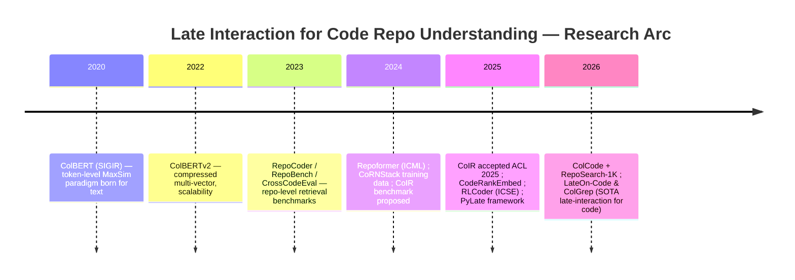

Late interaction models — the ColBERT family of multi-vector retrievers that defer query–document matching to a token-level MaxSim operator — have only recently been adapted to *code repository* understanding, and the latest research (2024–2026) shows them substantially outperforming single-vector dense retrievers on cross-file dependency queries while approaching cross-encoder accuracy at a fraction of the cost. Assuming "late internaction" is a typo for **late interaction**, the following synthesizes the state of the art, anchored in verified sources.

## Key recent models and papers at a glance

| Work | Year / Venue | Core contribution | Repo-level relevance | Benchmark / result |
|---|---|---|---|---|
| **LateOn-Code & ColGrep** (LightOn) | Feb 2026 (blog) | First publicly studied ColBERT-style models specialized for code retrieval; 17M & 149M params; hybrid regex + semantic CLI tool | Designed for coding agents navigating large repos locally | Top MTEB(Code); 149M fine-tuned model reaches **74.12 avg**, beating EmbeddingGemma-300M and closing in on 0.5–0.6B LLM-based embedders; ColGrep cuts search ops by 56% vs grep in Claude Code【turn1search2】【turn3fetch0】【turn6fetch0】 |
| **ColCode** (Al-Rashidi, Novotný, Kim) | 2026, DATAMIND 3(3) | ColBERT architecture adapted to code; introduces **RepoSearch-1K** benchmark (1,000 queries, 5 languages, 8 domains, engineer annotations) | Directly targets repository-level retrieval | Late interaction "substantially outperforms single-vector dense retrieval on cross-file dependency queries"; GraphCodeBERT still wins on AST-relationship queries【turn0search9】【turn2fetch1】 |
| **CoRNStack + CodeRankEmbed** | 2024 (arXiv 2412.01007) | High-quality contrastive (text, code) training data with mined hard negatives; trains a 137M bi-encoder and a listwise code reranker | Improves function localization in GitHub issues | SOTA across code retrieval benchmarks; outperforms 10× larger embedders【turn4search8】【turn4search11】 |
| **CoIR benchmark** | ACL 2025 Main | Comprehensive code IR benchmark: 10 datasets, 8 tasks, 7 domains; MTEB-compatible schema | Standardizes repo/code retrieval evaluation | Reveals even SOTA systems struggle on code retrieval【turn4search0】【turn4search2】 |
| **PyLate** | 2025 (arXiv 2508.03555) | Flexible training/retrieval framework to turn any encoder into a ColBERT-style late-interaction model | Enables training domain-specific (incl. code) late-interaction models | Lowers adoption barrier for multi-vector retrievers【turn0search0】【turn1search0】 |
| **ColBERT / ColBERTv2** | SIGIR 2020 / TACL 2021 | Foundational MaxSim late-interaction paradigm and compressed multi-vector index | Conceptual basis inherited by all code late-interaction work | Baseline for all subsequent adaptations【turn0search6】【turn1search11】 |
| **Repoformer** | ICML 2024 | Selective retrieval for repo-level completion; code LM self-evaluates whether to retrieve | Repo-level, but uses lexical/similarity retriever (not late interaction) | Matches 16B StarCoder with a 3B model; up to 70% inference speedup【turn1search12】【turn1search14】 |
| **RLCoder** | ICSE 2025 | RL-trained retriever without labels, using target-code perplexity as reward | Repo-level completion | SOTA on repo-level completion benchmarks【turn10search0】【turn10search2】 |

## Why late interaction fits code repository understanding

Late interaction keeps **per-token embeddings** on both the query and the document side and computes relevance as the sum of maximum similarities (MaxSim) between query tokens and document tokens. This design aligns unusually well with the structure of code【turn0search0】【turn0search4】:

- **Token-level granularity preserves identifiers and syntax.** Single-vector encoders collapse an entire function into one vector, washing out specific variable names, API calls, and type signatures. Late interaction keeps each token — `authMiddleware`, `UserService`, `fetchUserById` — as a distinct vector, so a query mentioning "authentication middleware" can match those exact identifiers softly even without lexical overlap【turn0search2】【turn3fetch0】.
- **Soft matching over lexical-style evidence.** As LightOn notes, ColBERT "shares a lot with lexical methods such as BM25" through its per-token representation, avoiding the aggressive compression of single-vector models, while still performing soft neural matching — robust when query and code don't share exact terms. Code retrieval is "a domain where these properties are especially relevant"【turn3fetch0】.
- **Out-of-domain and long-context strength.** Multi-vector models generalize better to unfamiliar repositories and long files than single-vector dense retrievers — both critical for repo-level tasks where the query distribution (developer intent) differs from the indexed corpus (source code)【turn0search0】【turn3fetch0】.
- **Cross-file dependency queries.** The ColCode/RepoSearch-1K evaluation isolates exactly the scenario where late interaction shines: finding relevant code across files when the query references behavior spanning modules【turn0search9】【turn2fetch1】.

## Latest research highlights

### LateOn-Code & ColGrep (LightOn, February 2026)
The most direct and recent entry. LightOn states that "to the best of our knowledge, ColBERT-style models have not been publicly studied for code retrieval," and fills that gap with two models pre-trained on **CoRNStack** (Go, Java, JavaScript, PHP, Python, Ruby) then fine-tuned on CoIR training data【turn3fetch0】.

- **LateOn-Code-edge (17M)** jumps from 57.50 (pre-trained) to **66.64** after fine-tuning on MTEB(Code), approaching EmbeddingGemma-300M while being 17× smaller【turn6fetch0】.
- **LateOn-Code (149M)** goes from 63.77 to **74.12**, "strongly outperforming EmbeddingGemma-300M" and closing in on Qwen3-Embedding-0.6B (75.42) and C2LLM-0.5B (75.46)【turn6fetch0】.
- **ColGrep** is a Rust CLI reproducing grep's interface but with semantic ranking via the LateOn-Code models and an embedded Rust multi-vector database (NextPlaid). It supports **hybrid queries** — regex filtering first, then late-interaction re-ranking — and runs fully locally with incremental index updates. In Claude Code benchmarks it found correct implementation details with **56% fewer search operations** and saved ~60,000 tokens per complex query, with savings in 70% of questions【turn3fetch0】【turn8fetch0】【turn9find0】【turn9find1】.

### ColCode & RepoSearch-1K (DATAMIND, 2026)
Al-Rashidi, Novotný and Kim evaluate six embedding strategies — BM25, GraphCodeBERT, CodeT5+, UniXcoder, Voyage Code 3, and a ColBERT-adapted **ColCode** — on a new 1,000-query, five-language, eight-domain benchmark with professional-engineer relevance judgments. The headline finding: late interaction "substantially outperforms single-vector dense retrieval on cross-file dependency queries," while structural embeddings (GraphCodeBERT) retain an edge on AST-relationship queries — suggesting the two are complementary for full repo understanding【turn0search9】【turn2fetch1】.

### Foundational and infrastructure work
- **PyLate** (arXiv 2508.03555) is the training/retrieval framework LateOn-Code was built on; it can convert most pre-trained language models into ColBERT-style retrievers and is the practical route to training a code-specific late-interaction model yourself【turn0search0】【turn1search0】.
- **CoRNStack** (arXiv 2412.01007) supplies the high-quality contrastive (docstring, function) pairs with mined hard negatives that both CodeRankEmbed and LateOn-Code rely on, and also trains a listwise code **reranker** — an under-explored companion to late-interaction first-stage retrieval【turn4search8】【turn4search11】.
- **CoIR** (ACL 2025) provides the standardized benchmark (AppsRetrieval, CodeSearchNet, CodeEditSearch, CodeFeedback, CodeTrans, StackOverflowQA, SyntheticText2SQL) that all of the above report on, and is integrated into the MTEB leaderboard【turn4search0】【turn4search1】【turn4search2】.

### Adjacent repo-level retrieval research (non-late-interaction, for context)
RepoCoder (iterative retrieve-generate, EMNLP 2023), Repoformer (selective retrieval, ICML 2024), and RLCoder (RL-trained retriever, ICSE 2025) tackle the same repo-level understanding problem but with similarity/lexical retrievers rather than multi-vector late interaction【turn1search3】【turn1search14】【turn10search0】. They define the downstream task (completion, bug fixing) and the benchmarks (RepoBench, RepoEval, CrossCodeEval, CrossCodeLongEval) that late-interaction retrievers are increasingly being plugged into【turn6search0】【turn6search1】【turn10search4】.

## Late interaction vs. single-vector vs. cross-encoder for code repos

The three retriever families trade off differently on the dimensions that matter for repository understanding:

- **Single-vector dense (CodeT5+, UniXcoder, Voyage Code 3, CodeRankEmbed, Qwen3-Embedding):** cheapest to index and query, but compresses a function/file into one vector, losing token-level identifiers — weakest on cross-file dependency and long-context queries【turn0search9】【turn3fetch0】.
- **Cross-encoder (CodeBERT/CodeT5 rerankers):** highest accuracy because query and document attend to each other, but O(n) scoring over the whole corpus is infeasible at repo scale; used as a second-stage reranker over a shortlist (e.g., the commit-message + CodeBERT reranker in arXiv 2502.07067)【turn0search5】【turn4search11】.
- **Late interaction (ColBERT, ColCode, LateOn-Code):** the middle ground — token-level matching接近 cross-encoder quality with pre-computed document token vectors enabling sub-linear ANN search, plus BM25-like out-of-domain robustness. Storage is ~10× a single-vector index, which is the main cost【turn1search11】【turn0search10】.

The empirical evidence now converges: for **repo-level** code understanding where queries describe intent and the relevant code lives across files with sparse lexical overlap, late interaction is the emerging sweet spot, while single-vector remains competitive on in-domain docstring-to-code and cross-encoders remain the rerank tier【turn0search9】【turn6fetch0】.

## Open challenges and future directions

- **Scaling multi-vector indexes to monorepos.** ColBERTv2-style compression (centroid residual + bit-packing) mitigates the ~10× storage blow-up, but million-file monorepos still strain multi-vector stores; ColGrep's incremental local indexing in Rust is one answer, but production-scale hybrid indexes remain open【turn1search11】【turn3fetch0】.
- **Cross-file dependency modeling beyond token MaxSim.** RepoSearch-1K shows GraphCodeBERT-style structural/AST embeddings beat purely semantic late interaction on AST-relationship queries — pointing toward **structure-aware late interaction** that conditions token interactions on the call/dependency graph as an open research direction【turn0search9】【turn2fetch1】.
- **Code-specific tokenization and identifier splitting.** ColBERT's WordPiece tokenization was designed for natural language; suboptimal splitting of camelCase/snake_case identifiers can dilute MaxSim. LateOn-Code mitigates this by starting from ModernBERT-based encoders "carefully crafted with code support right from the start," but dedicated code tokenizers for late interaction are largely unexplored【turn3fetch0】.
- **Retrieval granularity and chunking.** Repo understanding needs retrieval at varying granularities (symbol, block, file, module); how to chunk and index multi-vector representations per granularity without exploding storage is unsettled, and is a stated motivation for RepoSearch-1K【turn0search9】.
- **Selective and agentic retrieval.** Repoformer's finding — that retrieval is often "proving unhelpful or harmful" — suggests late-interaction retrievers should be paired with a self-evaluation policy that triggers retrieval only when beneficial, and ColGrep's hybrid regex+semantic approach is an early agentic integration【turn1search12】【turn3fetch0】.
- **The "grep is enough" counter-current.** A 2026 empirical study (arXiv 2605.15184) finds that with inline tool delivery, lexical grep "is uniformly stronger than dense retrieval" across harness–model pairs, and Claude Code famously removed vector search in favor of grep. This makes the late-interaction thesis — *soft matching over per-token evidence* — specifically positioned as a "stronger grep" that reconciles the lexical and neural camps, which is exactly how LightOn frames ColGrep【turn8fetch1】【turn3fetch0】.

## Outlook and resources

The trajectory is clear: late interaction is moving from a text-IR technique to a **purpose-built code retrieval paradigm**, with LateOn-Code/ColGrep and ColCode as the first concrete instantiations, CoRNStack as the training-data backbone, CoIR/RepoSearch-1K as the evaluation scaffolding, and PyLate as the open training stack. The next wave will likely combine structure-aware token interactions, retrieval-granularity-aware indexing, and selective agentic triggering. For hands-on entry points: the [LateOn-Code HuggingFace collection](https://lighton.ai/lighton-blogs/lateon-code-colgrep-lighton) and ColGrep CLI, the [PyLate](https://github.com/lightonai/pylate) training boilerplates, the [CoRNStack](https://github.com/gangiswag/cornstack) data, and the [CoIR](https://github.com/coir-team/coir) benchmark are the most actionable starting points【turn1search2】【turn1search0】【turn4search9】【turn4search1】.

If "late internaction" referred to a different specific model or paper than the late-interaction family above, let me know the intended name and the answer can be re-targeted.
